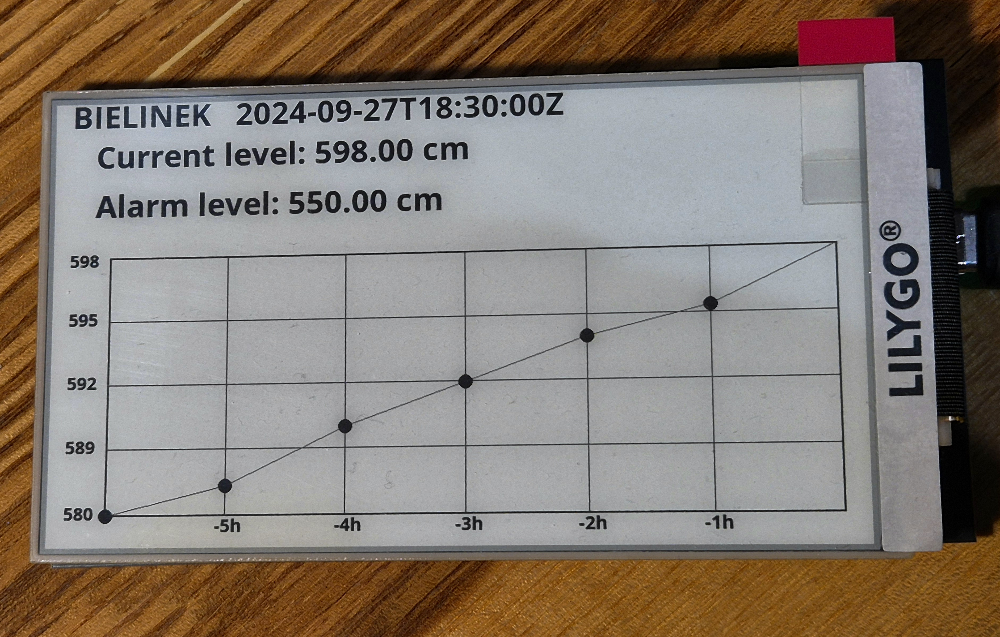

# River water level measurement

The main purpose of that project is to access data from **hydro.imgw.pl** website and present the data using **ESP32** device connected to the Internet

### First steps - Python program
I have written Python code to get to know with data from the website mentioned above :)

### ESP32 code
So far, it displays current:
* location
* time
* latest reading
* line graph that shows how the level changes over time

Remember to change the credentials to your Wi-Fi SSID and password in **credentials.h** file.

### TODO:
- autoupdate every 1 hour
- menu with more options
- switching between multiple locations

### Credits
Inspirations in the code and font header files are from the following repo: [url](https://github.com/CybDis/Lilygo-T5-4.7-WeatherStation-with-HomeAssistant.git)
